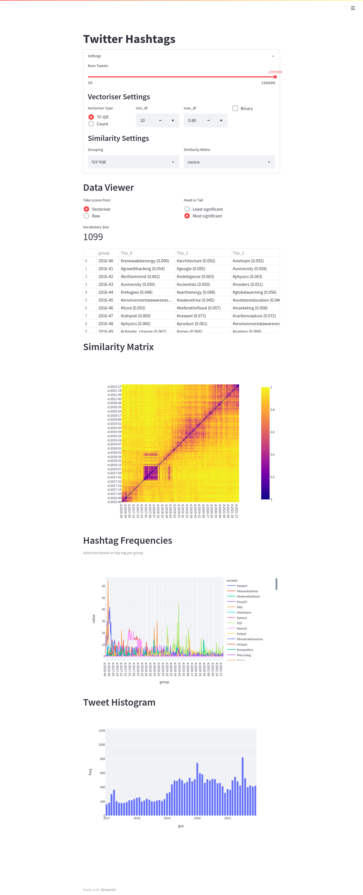

# Covid vs Climate on Twitter

Small data exploration project.

Current Features:
* Explore hashtag usage over time
* _[TODO]_ Explore Tweet similarities over time (VSM)
* _[TODO]_ Explore Tweet similarities over time (Embeddings)
* _[TODO]_ Some fun interactive UMAP Vis
* _[TODO]_ Some fun AlignedUMAP Animation

Note: May require Python 3.9+

### FrankenTopic aka BERTopic reloaded
#### UMAP vs tSNE
Using tSNE with $\alpha$<1 inspired by [Dmitry Kobak](https://link.springer.com/content/pdf/10.1007%2F978-3-030-46150-8_8.pdf?error=cookies_not_supported&code=df72ccd2-a465-42be-9212-58c81f8c5af6) instead of UMAP. 
This improves the clusterability of the two-dimensional projection, since UMAP apparently just creates a big blob in the middle forming a single large cluster.

#### HDBSCAN vs kMeans
For speed, use kMeans, also has clear control over the number of clusters and no tweets are outliers.
Has its own shortcomings though. To mitigate this, FrankenTopic has a mode where clusters with too few tweets are dumped. 
An intuitive setting would be to set it to (num_tweets/num_clusters)/2 or so.  
See settings `min_docs_per_topic` and `max_n_topics`.

Very informative documentation about how to pick HDBSCAN parameters [here](https://hdbscan.readthedocs.io/en/latest/parameter_selection.html)!

#### Notes for the future
Check out HDBSCAN [Soft Clustering](https://hdbscan.readthedocs.io/en/latest/soft_clustering.html), maybe we can use this to simulate cluster affinity or even some sort of topic distribution (after all – the "H" stands for hierarchical, and the softness stuff provides a score of how much something fits to a cluster aka topic).

### Hashtags
Small playground to get a feel for [streamlit](https://docs.streamlit.io/)
```bash
# To start, run
cd hashtags/
streamlit run hashtags.py
```
Open http://localhost:8501/ (or whatever port is assigned) to see the following:
